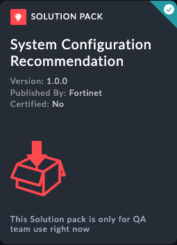
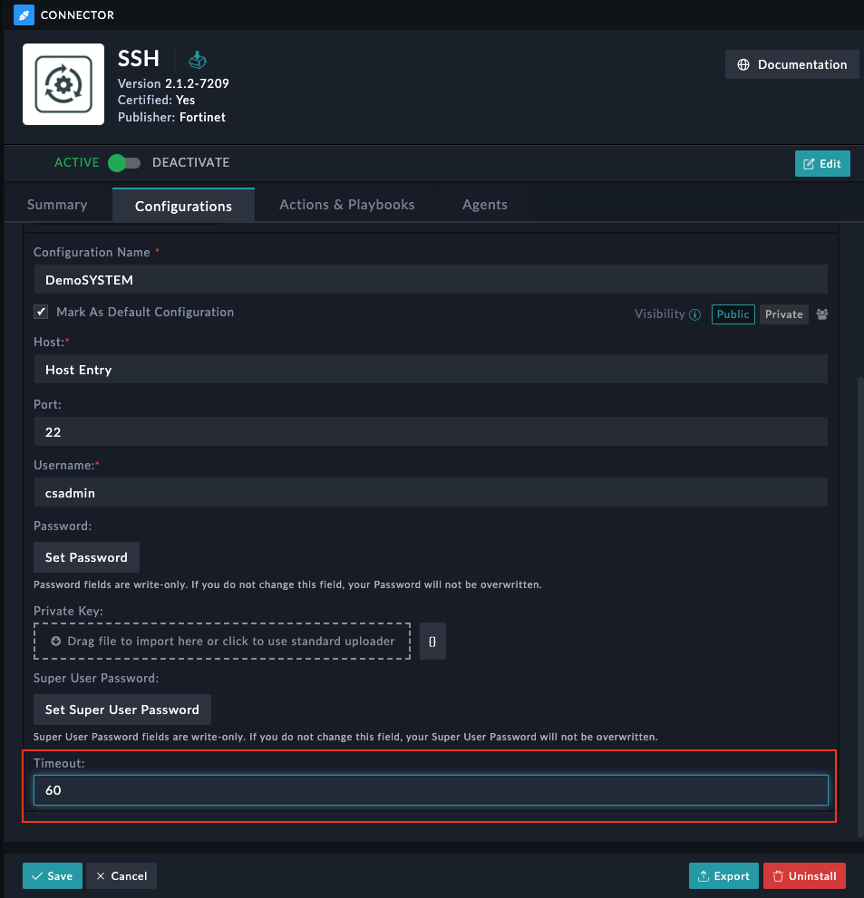

| [Home](../README.md) |
|--------------------------------------------|

# Installation

Install the Solution Pack. This is an example screenshot and what you see in the content hub may defer in version and details. 

# Configuration
 
 * Configure SSH connector for local system with timeout set to **60 seconds**

| [Usage](./usage.md) | [Contents](./contents.md) |
|---------------------|---------------------------|